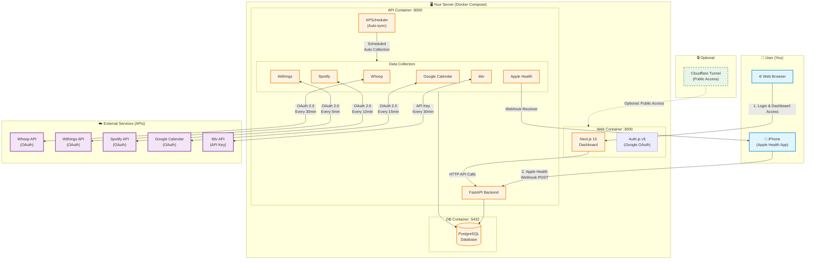

# Architecture

## System Overview

Personal Hub Template is a self-hosted personal data aggregation platform that runs entirely on your own server. When you deploy it, here's how the complete system works:



---

## Data Flow Explained

### 1️⃣ Initial Setup (One-time)

When you first deploy Personal Hub Template:

1. **Access the Dashboard**: Open `http://localhost:3000` (or your domain)
2. **Login with Google**: Authenticate using Google OAuth
3. **Connect Data Sources**: Go to Settings page and authorize each service
   - **OAuth Services**: Whoop, Withings, Spotify, Google Calendar
   - **API Key Services**: tldv
   - **Webhook Services**: Apple Health (configure in iOS app)

### 2️⃣ Automatic Data Collection (Background)

APScheduler runs in the background and automatically syncs data:

| Data Source | Sync Interval | What's Collected |
|-------------|---------------|------------------|
| **Whoop** | Every 30 minutes | Recovery score, sleep performance, workouts |
| **Withings** | Every 5 minutes | Body weight, body composition, blood pressure |
| **Spotify** | Every 10 minutes | Recently played tracks, listening history |
| **Google Calendar** | Every 15 minutes | Calendar events, meetings (multi-account) |
| **tldv** | Every 30 minutes | Meeting recordings, transcripts, highlights |
| **Apple Health** | Real-time | Health metrics via webhook (instant push) |

### 3️⃣ Data Query & Visualization

When you access the dashboard:

```
User → Web Browser
  → Next.js Frontend (Port 3000)
    → FastAPI Backend (Port 8000)
      → PostgreSQL Database (Port 5432)
        → Returns aggregated data
          → Visualized in Dashboard
```

### 4️⃣ Data Storage Structure

All data is stored in PostgreSQL with a unified schema:

```sql
-- Main data table
data_items
├─ id (UUID)
├─ source (whoop, spotify, tldv, etc.)
├─ source_id (external ID)
├─ category (health, entertainment, productivity)
├─ item_type (recovery, track, meeting, etc.)
├─ title
├─ content
├─ metadata (JSONB - source-specific details)
├─ created_at (timestamp of original data)
└─ synced_at (when data was synced)

-- Sync state tracking
sync_state
├─ source (collector name)
├─ last_sync_at
├─ cursor (OAuth tokens, pagination state)
├─ status (idle, running, error)
└─ items_synced
```

---

## Technology Stack

### Frontend (Port 3000)
- **Next.js 15**: React framework with App Router
- **Auth.js v5**: Authentication (Google OAuth)
- **shadcn/ui**: UI components
- **Tailwind CSS v4**: Styling
- **TypeScript**: Type safety

### Backend (Port 8000)
- **FastAPI**: Python async web framework
- **APScheduler**: Background task scheduling
- **SQLAlchemy**: ORM for PostgreSQL
- **httpx**: HTTP client for external APIs
- **Pydantic**: Data validation

### Database (Port 5432)
- **PostgreSQL 16**: Relational database
- **asyncpg**: Async database driver

### Deployment
- **Docker Compose**: Multi-container orchestration
- **Cloudflare Tunnel**: Optional public access
- **nginx**: Reverse proxy (for docs site)

---

## Security & Privacy

### 🔐 Key Security Features

1. **Self-Hosted**: All data stays on your server
2. **Single-User Model**: One hub per person (enforced by `ALLOWED_EMAIL`)
3. **OAuth 2.0**: Secure authorization for third-party services
4. **API Key Authentication**: Internal API requires valid key
5. **HTTPS**: Use Cloudflare Tunnel or reverse proxy for encryption

### 🛡️ Data Privacy

- **No Cloud Storage**: Your data never leaves your server
- **No Third-Party Analytics**: No tracking scripts
- **Open Source**: Full transparency (MIT License)
- **Modular Design**: Only enable data sources you want

---

## Deployment Options

### Option 1: Local Server
```bash
# Run on your home server or local machine
docker-compose up -d
# Access at http://localhost:3000
```

### Option 2: VPS with Cloudflare Tunnel
```bash
# Deploy on Hetzner, DigitalOcean, etc.
docker-compose --profile cloudflare up -d
# Access at https://yourdomain.com
```

### Option 3: Custom Reverse Proxy
```bash
# Use nginx, Caddy, or Traefik
docker-compose up -d
# Configure your own reverse proxy
```

---

## Extension & Customization

### Adding New Data Sources

1. Create collector in `api/collectors/`
2. Add OAuth/API integration
3. Register in scheduler (`api/services/sync.py`)
4. Add UI components in `web/src/`

See [Data Sources](DATA_SOURCES.md) for detailed guides.

### Custom Dashboards

- Modify `web/src/app/dash/` pages
- Add new visualizations
- Create custom queries to PostgreSQL

---

## Performance & Scalability

### Resource Requirements

**Minimum:**
- CPU: 1 core
- RAM: 512MB
- Storage: 10GB

**Recommended:**
- CPU: 2 cores
- RAM: 2GB
- Storage: 50GB

### Typical Usage

- **Database Size**: ~100MB per year (varies by sources)
- **API Requests**: ~500/day (with all sources enabled)
- **Memory Usage**: ~200-300MB (API + Web + DB)

---

## Troubleshooting

### Common Issues

1. **OAuth Callback Fails**: Check redirect URI matches exactly
2. **Data Not Syncing**: Verify API credentials and feature flags
3. **Database Connection Error**: Ensure PostgreSQL container is healthy

See [Setup Guide](SETUP.md) for detailed troubleshooting steps.
